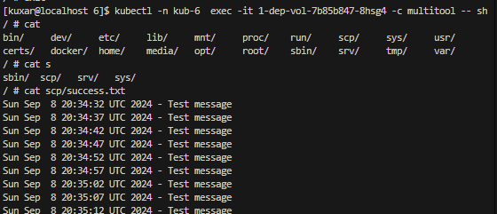
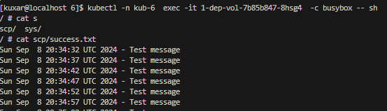
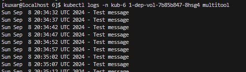
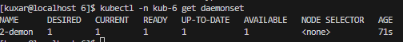
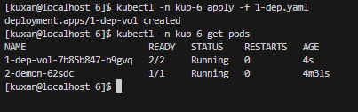
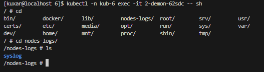

# kuber-06-keep-1

## Задание 1.

 kubectl create namespace kub-6

 kubectl apply -n kub-6 -f 1-dep.yaml

 kubectl -n kub-6  exec -it 1-dep-vol-7b85b847-8hsg4 -c multitool -- sh 

 kubectl -n kub-6  exec -it 1-dep-vol-7b85b847-8hsg4 -c busybox -- sh

kubectl logs -n kub-6 1-dep-vol-7b85b847-8hsg4 multitool

Манифест: [1-dep.yaml](yaml/1-dep.yaml)

kubectl delete -n kub-6 deployment 1-dep-vol

## Задание 2.

kubectl -n kub-6 apply -f 2-demon.yaml 

kubectl -n kub-6 get daemonset

kubectl -n kub-6 get pods

 kubectl -n kub-6 exec -it 2-demon-62sdc -- sh

Манифест:[2-demon.yaml](yaml/2-demon.yaml)

Задание 1
Что нужно сделать

Создать Deployment приложения, состоящего из двух контейнеров и обменивающихся данными.

Создать Deployment приложения, состоящего из контейнеров busybox и multitool.
Сделать так, чтобы busybox писал каждые пять секунд в некий файл в общей директории.
Обеспечить возможность чтения файла контейнером multitool.
Продемонстрировать, что multitool может читать файл, который периодоически обновляется.
Предоставить манифесты Deployment в решении, а также скриншоты или вывод команды из п. 4.
Задание 2
Что нужно сделать

Создать DaemonSet приложения, которое может прочитать логи ноды.

Создать DaemonSet приложения, состоящего из multitool.
Обеспечить возможность чтения файла /var/log/syslog кластера MicroK8S.
Продемонстрировать возможность чтения файла изнутри пода.
Предоставить манифесты Deployment, а также скриншоты или вывод команды из п. 2.